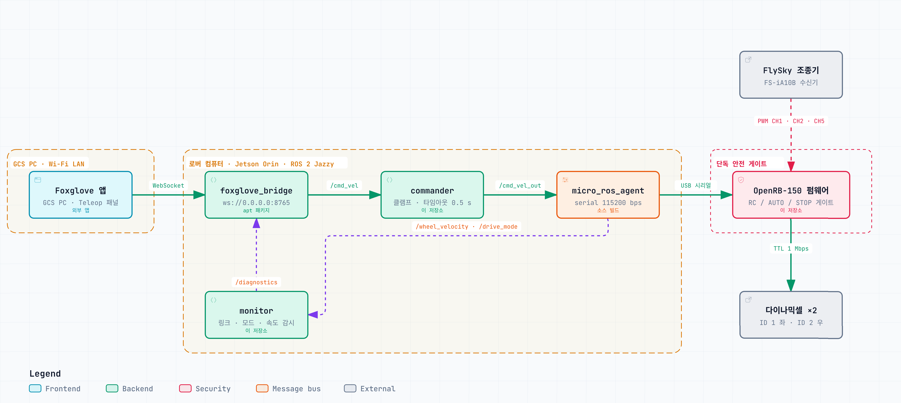

# UEL_Rover

ROS 2 (Jazzy) 기반 차동구동 로버 **UEL Rover** 의 소프트웨어 저장소.
제어보드 펌웨어, 임무 컴퓨터에서 도는 ROS 2 패키지,
지상국(GCS) 용 Foxglove 레이아웃, 로버 환경을 한 번에 구성하는 설치 스크립트를 담고 있다.

## 시스템 개요



## 저장소 구조

```
UEL_Rover/
├── README.md                        # 이 문서
├── docs/
│   └── architecture/                # 시스템 개요
│       ├── uel-rover.png
│       ├── uel-rover-runtime.html
│       └── uel-rover-runtime.architecture.json
├── scripts/
│   └── setup.sh                     # 로버(Jetson) 최초 1회 환경 설정
├── firmware/                        # 제어보드 펌웨어
│   └── OpenRB-150/
│       ├── README.md                # 배선, 빌드·업로드, ROS 인터페이스, 드라이브 모드, 확인할 상수
│       └── OpenRB-150.ino           
├── ros2_ws/                         # colcon 워크스페이스
│   └── src/uel_rover/               # ROS 2 패키지
│       ├── README.md                # 노드·파라미터·launch 인자 상세
│       ├── CMakeLists.txt
│       ├── package.xml
│       ├── src/
│       │   ├── commander.cpp        # /cmd_vel → /cmd_vel_out
│       │   └── monitor.cpp          # 제어보드 링크·모드·바퀴 속도 감시 → /diagnostics
│       ├── launch/
│       │   ├── bringup.launch.py    # micro_ros_agent + commander + monitor
│       │   └── gcs.launch.py        # foxglove_bridge (GCS 연결, 선택)
│       ├── config/
│       │   ├── rover.yaml           # commander / monitor 파라미터
│       │   └── foxglove_bridge.yaml # foxglove_bridge 파라미터
│       └── examples/                # ROS2 코드 예제
│           ├── README.md            # 각 예제를 패키지에 넣는 절차
│           ├── odometry/            # odom_publisher.cpp, odometry.yaml
│           ├── description/         # uel_rover.urdf, description.launch.py
│           ├── sensors/             # RealSense D455 → /scan
│           └── navigation/          # Nav2, slam_toolbox, AMCL launch/yaml
└── gcs/
    ├── README.md                    # Foxglove 설치·접속·패널·조종·문제 해결
    └── foxglove/
        └── uel_rover_gcs.json       # Foxglove 레이아웃
```

### 문서 지도

| 알고 싶은 것 | 문서 |
|---|---|
| 제어보드 배선, 펌웨어 빌드·업로드, 드라이브 모드 규칙, 배포 전 확인할 상수 | [firmware/OpenRB-150/README.md](firmware/OpenRB-150/README.md) |
| commander / monitor 노드 동작, 파라미터, launch 인자, 빌드·실행 | [ros2_ws/src/uel_rover/README.md](ros2_ws/src/uel_rover/README.md) |
| 오도메트리, URDF, RealSense, Nav2 를 패키지에 넣는 방법 | [ros2_ws/src/uel_rover/examples/README.md](ros2_ws/src/uel_rover/examples/README.md) |
| Foxglove 앱 설치, 접속, 패널 구성, Teleop, 문제 해결 | [gcs/README.md](gcs/README.md) |

## 초기 설정

세 곳을 각각 준비한다. 제어보드 → 로버 컴퓨터 → GCS PC 순서가 편하다.

### 1. 제어보드 (OpenRB-150)

Arduino IDE 에서 펌웨어를 올린다. 자세한 절차는 [firmware/OpenRB-150/README.md](firmware/OpenRB-150/README.md).

1. Boards Manager 에서 **OpenRB-150** 보드 패키지 설치.
2. 라이브러리 설치: **DynamixelShield** (Library Manager), **micro_ros_arduino** (ROS 2 **Jazzy** 릴리스 zip 수동 설치).
3. `firmware/OpenRB-150/OpenRB-150.ino` 상단 `#define` 상수를 실기에 맞게 확인한다.
   모터 ID (`DXL_LEFT_ID` / `DXL_RIGHT_ID`), 우측 모터 반전 (`RIGHT_MOTOR_INVERTED`), `MAX_RPM`,
   `WHEEL_BASE`, `WHEEL_RADIUS`.
4. 보드를 OpenRB-150 으로 선택하고 업로드.
5. 업로드 후 **시리얼 모니터를 열지 않는다.** USB 시리얼이 micro-ROS 트랜스포트다.

수신기 배선: CH1 → D6, CH2 → D7, CH5 → D8, GND 공통. 다이나믹셀은 TTL 포트 직결 (ID 1 좌, 2 우).

### 2. 로버 컴퓨터 (Jetson)

전제: Ubuntu 24.04 (noble), sudo 사용 가능, 인터넷 연결.

```bash
git clone https://github.com/Porofly/UEL_Rover.git
cd UEL_Rover
./scripts/setup.sh --bashrc                      # 기본 구성
./scripts/setup.sh --with-examples --bashrc      # examples/ 용 패키지까지 설치할 때
```

스크립트가 하는 일. 이미 끝난 단계는 건너뛰므로 재실행해도 안전하다.

| 단계 | 내용 |
|---|---|
| 1 | ROS 2 Jazzy 설치 (`/opt/ros/jazzy` 가 없을 때만) |
| 2 | 빌드 도구 설치, rosdep 초기화 |
| 3 | `ros2_ws` 의존성 설치 (rosdep). `foxglove_bridge` 포함 |
| 4 | `--with-examples` 일 때 RealSense, Nav2, slam_toolbox 등 설치 |
| 5 | micro-ROS agent 소스 빌드 → `microros_ws/` |
| 6 | `ros2_ws` colcon 빌드 (Release) |
| 7 | 사용자를 `dialout` 그룹에 추가 (제어보드 USB 시리얼 접근) |

| 옵션 | 효과 |
|---|---|
| `--with-examples` | examples/ 에 필요한 ROS 패키지도 설치 |
| `--skip-agent` | micro-ROS agent 빌드 생략 |
| `--skip-build` | ros2_ws 빌드 생략 |
| `--bashrc` | `~/.bashrc` 에 환경 source 블록 추가 (한 번만 추가됨) |

완료 후 **재로그인**(또는 `newgrp dialout`) 해야 `/dev/ttyACM0` 에 접근할 수 있다.
`--bashrc` 를 쓰지 않았다면 새 셸마다 다음을 source 한다. 세 줄 모두 필요하다.
`microros_ws` 를 빼면 launch 가 `micro_ros_agent` 를 찾지 못한다.

```bash
source /opt/ros/jazzy/setup.bash
source ~/UEL_Rover/microros_ws/install/local_setup.bash
source ~/UEL_Rover/ros2_ws/install/setup.bash
```

스크립트 없이 수동으로 빌드하려면 [ros2_ws/src/uel_rover/README.md](ros2_ws/src/uel_rover/README.md) 의 "빌드" 절을 따른다.

### 3. GCS PC

ROS 2 가 필요 없다. 브릿지는 로버에서 돈다.

1. Foxglove 데스크톱 앱 설치 (https://foxglove.dev/download). 웹 버전은 `ws://` 접속이 안 되므로 데스크톱 앱을 쓴다.
2. 로버와 같은 네트워크에 연결하고 로버 IP 를 확인한다.
3. 앱에서 **Layouts → Import from file** 로 `gcs/foxglove/uel_rover_gcs.json` 을 불러온다.

## 기본 사용법

### 실행

로버에서 터미널 두 개를 연다. GCS 를 쓰지 않으면 두 번째는 생략한다.

```bash
ros2 launch uel_rover bringup.launch.py     # micro_ros_agent + commander + monitor
ros2 launch uel_rover gcs.launch.py         # foxglove_bridge, ws://0.0.0.0:8765
```

| launch | 인자 | 기본값 | 설명 |
|---|---|---|---|
| bringup | `serial_port` | `/dev/ttyACM0` | 제어보드 USB 시리얼 장치 |
| bringup | `baudrate` | `115200` | micro-ROS 시리얼 보레이트 |
| bringup | `start_agent` | `true` | `false` 면 agent 를 따로 띄운다 |
| bringup | `params_file` | `config/rover.yaml` | commander / monitor 파라미터 |
| gcs | `port` | `8765` | WebSocket 포트 |
| gcs | `address` | `0.0.0.0` | 바인드 주소. `127.0.0.1` 이면 로버 안에서만 접속 |
| gcs | `params_file` | `config/foxglove_bridge.yaml` | foxglove_bridge 파라미터 |

예: `ros2 launch uel_rover bringup.launch.py serial_port:=/dev/ttyACM1`

### 조종기 스위치 (드라이브 모드)

| CH5 스위치 | 모드 | 동작 |
|---|---|---|
| 한쪽 끝 (≥ 1700 µs) | **RC** | 조종기로 직접 구동. 소프트웨어 명령 무시 |
| 반대쪽 끝 (≤ 1300 µs) | **AUTO** | `/cmd_vel_out` 적용. agent 연결 + 새 명령 수신 + 500 ms 워치독을 모두 만족할 때만 구동 |
| 가운데 | **STOP** | 즉시 정지 |

처음 켤 때는 STOP 또는 RC 에 두고, 소프트웨어로 움직일 때만 AUTO 로 넘긴다.
비상시에는 스위치를 RC 나 STOP 으로 넘기는 것이 가장 빠르다.

### 동작 확인

```bash
ros2 topic echo /diagnostics        # uel_rover/control_board 상태: OK / WARN / ERROR / STALE
ros2 topic echo /drive_mode         # 조종기 스위치 상태 "RC" | "AUTO" | "STOP"
ros2 topic hz /wheel_velocity       # 제어보드 링크 확인, 약 50 Hz

# 조종기를 AUTO 로 둔 상태에서 (10 Hz 로 반복 발행해야 계속 움직인다)
ros2 topic pub -r 10 /cmd_vel geometry_msgs/msg/Twist "{linear: {x: 0.1}}"
# 또는 키보드 조종 (sudo apt install ros-jazzy-teleop-twist-keyboard)
ros2 run teleop_twist_keyboard teleop_twist_keyboard
```

`/diagnostics` 의 레벨 의미: STALE 은 제어보드에서 아직 아무것도 못 받음, ERROR 는 받다가
끊김, WARN 은 비물리적 바퀴 속도 감지, OK 는 정상 (message 에 현재 모드 표시).

### GCS 에서 보고 조종하기

1. Foxglove 에서 **Open connection → Foxglove WebSocket**, URL `ws://<로버 IP>:8765`.
2. 접속되면 Diagnostics 패널에 `uel_rover/control_board` 가, Indicator 에 드라이브 모드 색이 뜬다.
3. 조종기를 **AUTO** 로 두고 Teleop 패널 방향 버튼을 누르면 `/cmd_vel` 이 10 Hz 로 나간다.
   기본 속도는 0.15 m/s, 0.6 rad/s. 버튼을 떼면 commander 가 0.5 s 후 정지 명령을 보낸다.
4. 패널별 설명과 문제 해결은 [gcs/README.md](gcs/README.md).

### ROS 2 인터페이스 요약

| 토픽 | 타입 | 발행 → 구독 | 비고 |
|---|---|---|---|
| `/cmd_vel` | `geometry_msgs/Twist` | 상위 제어기 → commander | 사용자가 발행하는 유일한 입력 |
| `/cmd_vel_out` | `geometry_msgs/Twist` | commander → 제어보드 | 클램프된 명령. 직접 발행하지 않는다 |
| `/wheel_velocity` | `std_msgs/Float32MultiArray` `[vL_rpm, vR_rpm]` | 제어보드 → monitor | 50 Hz |
| `/drive_mode` | `std_msgs/String` `"RC"/"AUTO"/"STOP"` | 제어보드 → monitor | 50 Hz |
| `/diagnostics` | `diagnostic_msgs/DiagnosticArray` | monitor → GCS, rqt | 상태명 `uel_rover/control_board`, 1 Hz |

commander 파라미터 (`config/rover.yaml`): `max_linear_velocity` 0.26 m/s, `max_angular_velocity` 1.0 rad/s, `command_timeout` 0.5 s.
monitor 파라미터: `link_timeout` 0.5 s, `max_wheel_rpm` 100, `diagnostics_period` 1.0 s.
자세한 동작은 [ros2_ws/src/uel_rover/README.md](ros2_ws/src/uel_rover/README.md).

## 기능 추가 안내

### 무엇을 어디에 넣는가

| 추가할 것 | 위치 | 추가로 할 일 |
|---|---|---|
| 새 C++ 노드 | `ros2_ws/src/uel_rover/src/*.cpp` | `CMakeLists.txt` 에 `add_executable` / `target_link_libraries` 추가, `install(TARGETS ...)` 목록에 추가. 새 메시지 패키지를 쓰면 `find_package` 와 `package.xml` `<depend>` 도 추가 |
| launch 파일 | `launch/*.launch.py` | 없음. 디렉터리째 설치된다 |
| 파라미터 yaml | `config/*.yaml` | 없음. 디렉터리째 설치된다 |
| 새 디렉터리 (예: `urdf/`) | 패키지 루트 | `CMakeLists.txt` 의 `install(DIRECTORY launch config ...)` 에 추가 |
| 외부 ROS 패키지 의존 | `package.xml` | `<depend>` 또는 `<exec_depend>` 로 선언하면 `setup.sh` 의 rosdep 단계가 설치한다 |
| 제어보드 동작 변경 | `firmware/OpenRB-150/OpenRB-150.ino` | 아래 "펌웨어를 수정할 때" 참고 |
| GCS 화면 | `gcs/foxglove/uel_rover_gcs.json` | Foxglove 에서 편집 후 **Layouts → Export** 로 덮어쓴다 |

수정 후에는 `ros2_ws` 에서 `colcon build --symlink-install` 을 다시 돌리고 `install/setup.bash` 를 source 한다.
`--symlink-install` 덕분에 launch 와 yaml 은 수정만 하면 바로 반영되지만, 파일을 새로 추가했을 때는 다시 빌드해야 한다.

### 참고 구현(examples) 되살리기

빌드되지 않는 참고 구현이 네 묶음 있다. 필요한 것만 골라 넣는다.
절차는 [examples/README.md](ros2_ws/src/uel_rover/examples/README.md), 패키지 설치는 `setup.sh --with-examples`.

| 디렉터리 | 추가되는 것 | 넣는 방법 |
|---|---|---|
| `odometry/` | `/wheel_velocity` → `/odom`, `odom→base_link` TF | cpp 를 `src/` 로, yaml 을 `config/` 로 복사하고 CMake / package.xml 에 nav_msgs, tf2, tf2_ros 추가 |
| `description/` | URDF, `base_link→camera_link` 및 바퀴 정적 TF | urdf 를 `urdf/` 에 두고 install 목록에 추가, launch 복사 |
| `sensors/` | RealSense D455 → `/scan` | launch / yaml 복사 |
| `navigation/` | Nav2, slam_toolbox 매핑, map_server + AMCL | launch / yaml 복사 |

전체를 되살리는 실행 순서는 bringup → odometry → description → sensors → nav2 → mapping 또는 localization 이다.
TF 트리는 `map → odom → base_link → camera_link, 바퀴`.

### 상위 제어기(조종·자율주행 노드)를 만들 때

- **`/cmd_vel` 에 `geometry_msgs/Twist` 로 발행한다.** `TwistStamped` 가 아니다. Nav2 를 쓰면 `enable_stamped_cmd_vel: false` 가 필요하다.
- **주기적으로 발행한다.** commander 는 명령을 반복 발행하지 않는다. 제어보드 워치독 500 ms 안에 다음 명령이 와야 계속 움직이므로 10 Hz 정도로 보낸다.
- 발행을 멈추면 로버가 선다. commander 가 `command_timeout`(0.5 s) 후 정지 명령을 한 번 보내고, 제어보드 워치독도 같은 시간에 정지한다.
- `linear.x`, `angular.z` 만 쓰인다. 나머지 성분은 버려진다. 상한을 넘는 값은 `max_linear_velocity` / `max_angular_velocity` 로 잘리고, NaN / Inf 는 정지 명령이 된다.
- **`/cmd_vel_out` 에 직접 발행하지 않는다.** commander 의 클램프와 타임아웃을 건너뛴다.
- 드라이브 모드 게이팅은 제어보드가 한다. 소프트웨어에서 `/drive_mode` 를 읽어 다시 막을 필요는 없지만, AUTO 가 아닐 때 명령이 무시된다는 점은 상위 로직에서 알고 있어야 한다.

### 파라미터를 바꿀 때

`config/rover.yaml` 을 고치거나, 복사본을 만들어 `params_file:=` 로 넘긴다.
값 사이에는 다음 관계가 있으므로 한쪽만 바꾸지 않는다.

| 항목 | 값이 묶여 있는 곳 |
|---|---|
| commander `command_timeout` (0.5 s) | 펌웨어 `WATCHDOG_MS` (500). 같게 유지한다 |
| monitor `max_wheel_rpm` (100) | 펌웨어 `MAX_RPM` (50) 의 2배 |
| monitor `link_timeout` (0.5 s) | 제어보드 발행 주기 50 Hz 기준 25 주기 누락 |
| commander 속도 상한 | 펌웨어 `MAX_RPM` 과 바퀴 반지름으로 정해지는 물리 한계 이내 |

### 펌웨어를 수정할 때

- **`Serial.print` 를 쓰지 않는다.** USB 시리얼이 micro-ROS 트랜스포트라 출력이 통신을 깨뜨린다. 시리얼 모니터도 열지 않는다.
- micro_ros_arduino 는 ROS 2 **Jazzy** 릴리스를 쓴다. 로버 쪽 agent 도 `jazzy` 브랜치로 빌드된다.
- 토픽 이름이나 메시지 타입을 바꾸면 commander / monitor / GCS 레이아웃도 같이 바꾼다. 토픽은 `/cmd_vel_out`, `/wheel_velocity`, `/drive_mode`, 노드 이름은 `openrb150`.
- `MAX_RPM` 을 바꾸면 `rover.yaml` 의 `max_wheel_rpm` 을 2배로 맞춘다. `WHEEL_BASE` / `WHEEL_RADIUS` 를 바꾸면 오도메트리 쪽 값과 통일한다 (아래 "알려진 주의사항").
- 드라이브 모드 판정과 RC / STOP 제어는 micro-ROS 상태 머신보다 먼저, 무조건 실행되는 구조다. 이 순서를 유지해야 조종기가 데드맨 스위치로 작동한다.

### GCS 를 확장할 때

- 패널 추가는 Foxglove 앱에서 하고 레이아웃을 `gcs/foxglove/uel_rover_gcs.json` 으로 내보낸다.
- 로버에서 발행 가능한 토픽을 제한하려는 `client_topic_whitelist` 가 `config/foxglove_bridge.yaml` 에 있지만, apt 의 foxglove_bridge 3.5.0 은 적용하지 않는다. 그래서 **레이아웃에 `/cmd_vel` 외의 발행 패널을 두지 않는다**는 규칙으로 대신한다.
- 무선 대역폭이 부족하면 `topic_whitelist` 로 GCS 에 보낼 토픽을 줄인다.
- 게임패드 (`teleop_twist_joy`), 카메라 영상, Nav2 목표점 지정 등 확장 예는 [gcs/README.md](gcs/README.md) 의 "확장" 절.

### 문서

디렉터리마다 README 가 있고, 각 README 는 그 디렉터리의 구성 트리와 인터페이스 표를 담고 있다.
파일이나 토픽, 파라미터를 추가하면 해당 README 의 표도 같이 고친다. 이 문서의 구조 트리와
인터페이스 요약도 마찬가지다.

## 알려진 주의사항

| 항목 | 내용 |
|---|---|
| 바퀴 상수 불일치 | 펌웨어 `WHEEL_BASE` 0.30 m / `WHEEL_RADIUS` 0.065 m 와 `examples/odometry/odometry.yaml` 의 0.915 m / 0.0877 m (실측 보정값) 가 다르다. AUTO 모드에서 Nav2 가 명령한 속도와 실제 속도가 어긋나므로 배포 전에 한쪽으로 통일한다. |
| GCS 발행 제한 미적용 | `client_topic_whitelist` 는 foxglove_bridge 3.5.0 에서 읽히기만 하고 적용되지 않는다. GCS 가 어떤 토픽이든 발행할 수 있다. |
| micro_ros_agent 는 소스 빌드 | apt 패키지가 없어 `microros_ws/` 에 별도 빌드한다. 세 워크스페이스를 모두 source 해야 launch 가 agent 를 찾는다. |
| 시리얼 모니터 금지 | 제어보드 USB 시리얼은 micro-ROS 전용이다. Arduino 시리얼 모니터나 다른 프로그램이 잡고 있으면 agent 가 붙지 못한다. |
| examples 의 `localization.yaml` | `global_costmap` static 오버레이는 어떤 노드에도 로드되지 않는다(비활성). 저장맵 기반 전역 계획을 쓰려면 planner_server 에 넘겨야 한다. |

## 문제 해결

| 증상 | 확인할 것 |
|---|---|
| `/dev/ttyACM0` 권한 오류 | `dialout` 그룹 반영 여부 (`id -nG`). `setup.sh` 후 재로그인했는지 |
| launch 가 `micro_ros_agent` 를 못 찾음 | `microros_ws/install/local_setup.bash` 를 source 했는지 |
| `/diagnostics` 가 STALE | 제어보드 USB 연결, `serial_port` 인자, agent 로그. 시리얼 모니터가 포트를 잡고 있지 않은지 |
| `/diagnostics` 가 ERROR | 받다가 끊긴 것. USB 케이블, 제어보드 전원, agent 재시작 여부 |
| `/cmd_vel` 을 보내도 안 움직임 | 조종기 스위치가 AUTO 인지, `/drive_mode` 가 `"AUTO"` 인지, 발행 주기가 500 ms 이내인지, `/cmd_vel_out` 이 나오는지 |
| GCS 접속 불가 | `gcs.launch.py` 실행 여부, 로버 IP, 8765/tcp 방화벽 |

GCS 관련 문제는 [gcs/README.md](gcs/README.md), 제어보드 문제는 [firmware/OpenRB-150/README.md](firmware/OpenRB-150/README.md) 의 해당 절을 함께 본다.